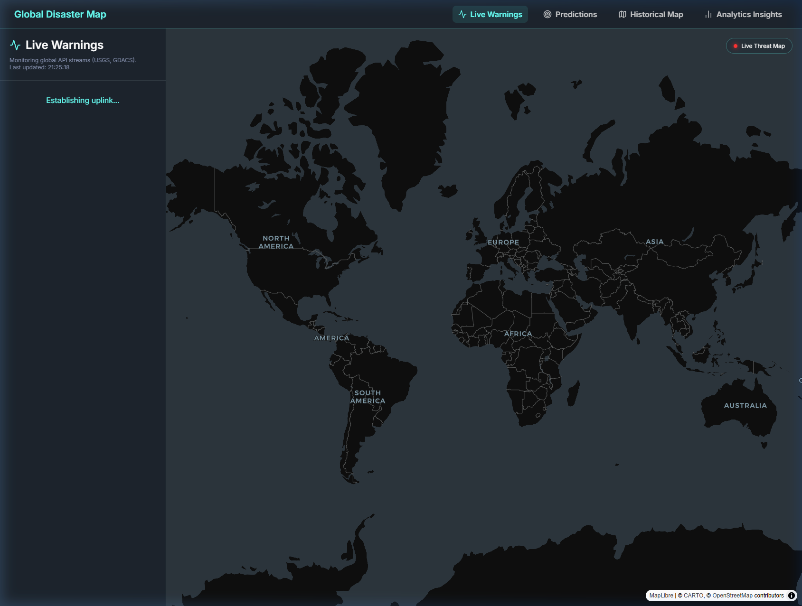
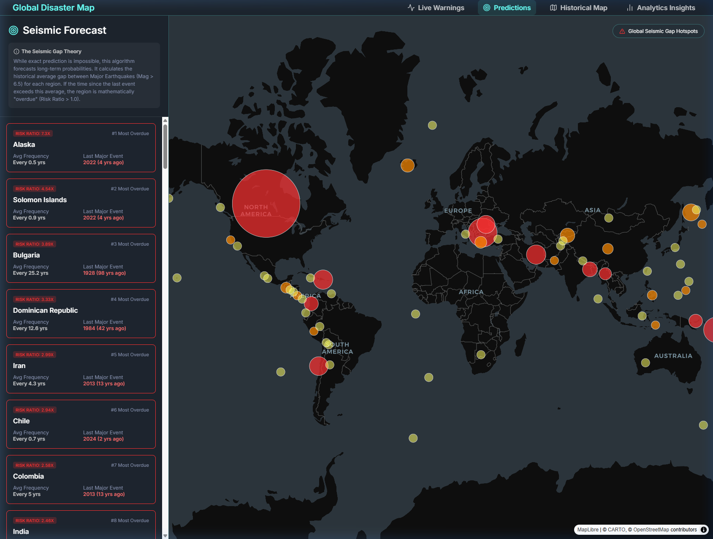
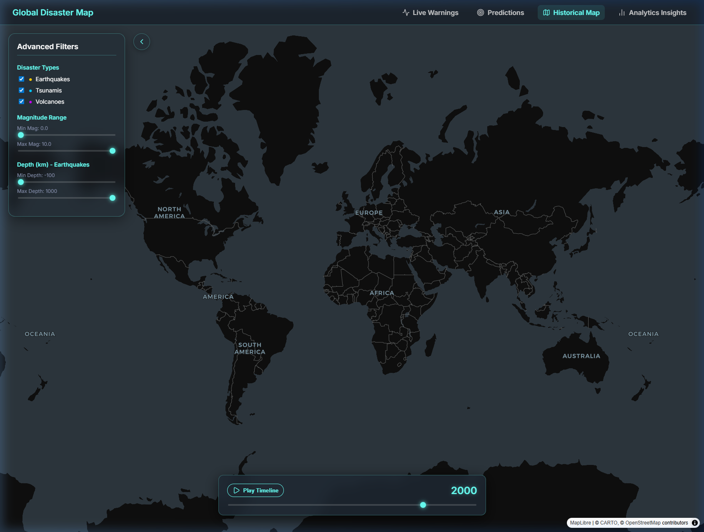
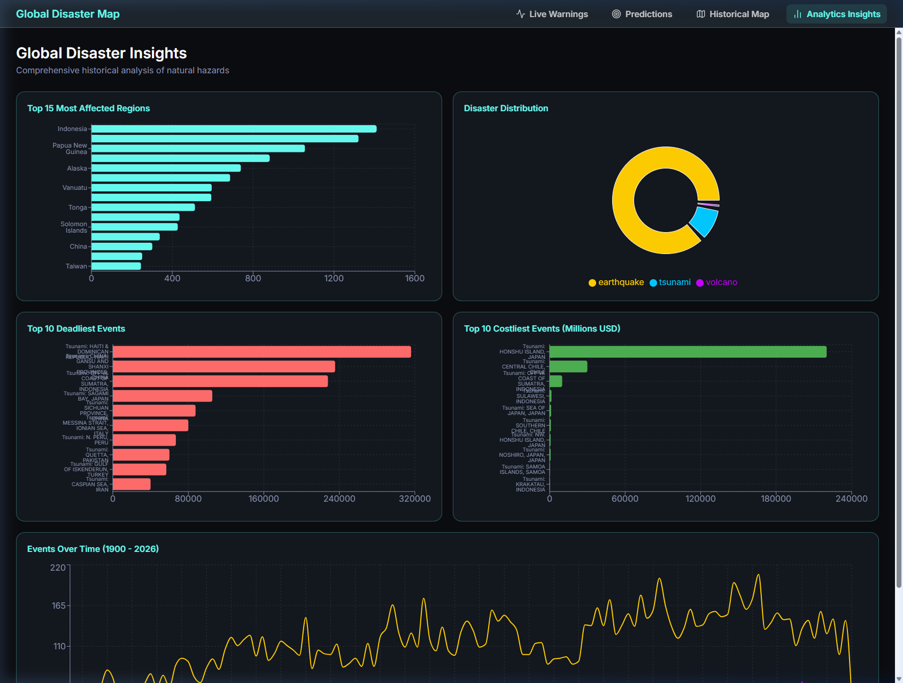

# Global Disaster Map

A dynamic, interactive web application that visualizes historical natural hazards—Earthquakes, Tsunamis, and Volcanoes—across the globe. 

When, where, and why did disaster strike? What can we learn about it? What was the media coverage? The Global Disaster Map aims to answer these questions by providing an immersive 3D globe visualization alongside deep analytical insights and integrated historical media context.

## 🌟 Application Features

### 🚨 Live Early Warning Center
A real-time "Mission Control" interface that monitors active global disaster threats. It aggregates live JSON feeds from GDACS and the USGS, offering color-coded Threat Level badges and exact timestamps.


### 🎯 Seismic Predictions Engine
An algorithm-driven forecast dashboard that identifies the world's most "overdue" regions. Using 125 years of historical data, it calculates the average gap between Magnitude 6.5+ earthquakes for each region and highlights the highest "Risk Ratio" hotspots on a WebGL map based on the Seismic Gap Theory.


### 🗺️ Historical 3D Map
A dynamic 3D globe visualization of over 15,000 historical natural hazards. Features a playback timeline animation, deep Wikipedia integration for contextual insights, and a sleek glassmorphism sidebar to filter by magnitude and type.


### 📊 Analytics Insights
A deeply interactive, cross-filtering dashboard powered by Recharts. Clicking on any country or disaster type dynamically filters all other visualizations, allowing you to instantly drill down into 125 years of global casualty and economic impact data.


## 🛠️ Technology Stack

- **Frontend**: React (Vite), Deck.gl, React Map GL (MapLibre), Recharts, React Router Dom, vanilla CSS (Glassmorphism & Dark Mode).
- **Backend**: Python, FastAPI, SQLite (Local database).
- **External Integrations**: Wikipedia API (for fetching historical details and media).

---

## 🚀 Getting Started

Follow these instructions to run the application locally on your machine.

### Prerequisites
- [Python 3.8+](https://www.python.org/downloads/)
- [Node.js 18+](https://nodejs.org/)

### 1. Backend Setup

The backend serves the disaster data from an SQLite database and fetches external details from Wikipedia.

1. Open a terminal and navigate to the `backend` directory:
   ```bash
   cd backend
   ```
2. (Optional but recommended) Create and activate a virtual environment:
   ```bash
   python -m venv venv
   # On Windows:
   .\venv\Scripts\activate
   # On macOS/Linux:
   source venv/bin/activate
   ```
3. Install the required Python dependencies (FastAPI, Uvicorn, Requests):
   ```bash
   pip install fastapi uvicorn requests
   ```
4. Start the FastAPI development server:
   ```bash
   uvicorn main:app --reload
   ```
   *The backend API will now be running at `http://127.0.0.1:8000`.*

### 2. Frontend Setup

The frontend is a React application built with Vite.

1. Open a **new** terminal window and navigate to the `frontend` directory:
   ```bash
   cd frontend
   ```
2. Install the necessary Node.js packages:
   ```bash
   npm install
   ```
3. Start the Vite development server:
   ```bash
   npm run dev
   ```
4. Open your web browser and navigate to the local URL provided by Vite (usually `http://localhost:5173`).

Enjoy exploring the Global Disaster Map!
